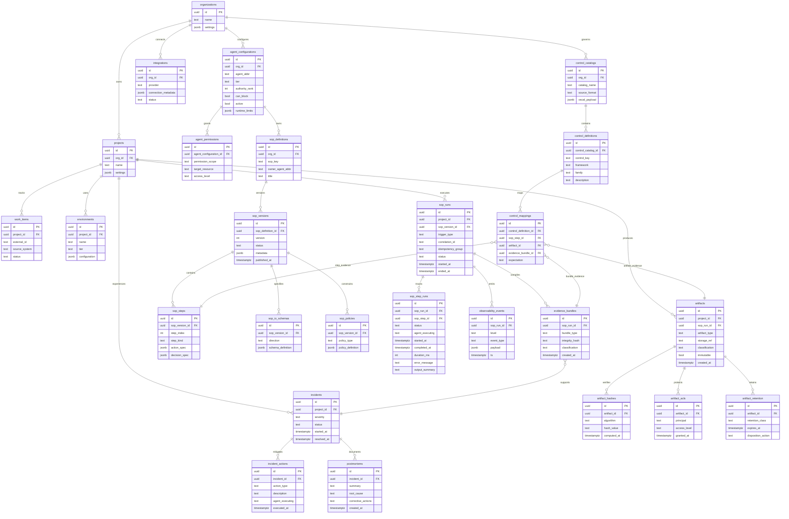

# Enhanced SOP Execution Data Model — Target State ERD

> Phase 2+ target-state entity-relationship model for the HELIos SOP execution engine. Extends the Phase 1 baseline model (9 entities) to a comprehensive 23-entity schema covering multi-tenancy, agent configuration, supply chain integrity, incident management, and machine-readable compliance controls.
>
> **Relationship to baseline model:** The Phase 1 baseline ERD is documented in [`helios/reference/sop-execution-data-model.md`](../sop-execution-data-model.md). That model covers the core SOP lifecycle (definitions → versions → steps → runs → step_runs → artifacts → observability → controls). This enhanced model adds organizational context, agent runtime configuration, artifact integrity/access/retention, incident management, and OSCAL-aligned control catalogs. Both models coexist — the baseline is implementable now; this model is the migration target.

---

## 1. Entity Relationship Diagram

---

## 2. Entity Purpose Table

### Organizational Context (New in Enhanced Model)

| Entity | Purpose | Baseline Model? |
|--------|---------|:---------------:|
| `organizations` | Multi-tenant root. All data scoped to an organization for RLS enforcement. | No |
| `projects` | Organizational unit for work items, SOP runs, artifacts, and incidents. | No |
| `environments` | Deployment targets (staging, production, etc.) per project. | No |
| `work_items` | External work item references (Linear issues, GitHub PRs) linked to project context. | No |
| `integrations` | Connection metadata for external platforms (GitHub, Linear, Supabase, Vercel, Notion). | No |

### Agent Runtime Configuration (New in Enhanced Model)

| Entity | Purpose | Baseline Model? |
|--------|---------|:---------------:|
| `agent_configurations` | Runtime parameters per agent: tier, authority rank, blocking capability, active status, resource limits. | No |
| `agent_permissions` | Granular permission grants per agent: scoped to specific resources and access levels (least privilege enforcement). | No |

### SOP Lifecycle (Extended from Baseline)

| Entity | Purpose | Baseline Model? |
|--------|---------|:---------------:|
| `sop_definitions` | Canonical SOP registry. Enhanced: adds `org_id` and `sop_key` for multi-tenant scoping. | Yes (extended) |
| `sop_versions` | Immutable version records. Enhanced: adds `metadata` JSONB and `published_at`. | Yes (extended) |
| `sop_steps` | Step definitions within a version. Enhanced: adds `step_kind`, `action_spec`, `decision_spec` for executable steps. | Yes (extended) |
| `sop_io_schemas` | Typed input/output contracts per SOP version. Enables schema validation before execution. | No |
| `sop_policies` | Constraints and rules per SOP version (retry policies, timeout limits, classification rules). | No |

### Execution Tracing (Same Core, Extended)

| Entity | Purpose | Baseline Model? |
|--------|---------|:---------------:|
| `sop_runs` | Execution instances. Enhanced: adds `project_id`, `idempotency_group` for replay safety. | Yes (extended) |
| `sop_step_runs` | Step-level execution records. Same structure as baseline. | Yes |
| `observability_events` | Runtime events. Enhanced: `sop_run_id` replaces `sop_step_run_id` for broader scope. | Yes (extended) |

### Artifact Management (Significantly Extended)

| Entity | Purpose | Baseline Model? |
|--------|---------|:---------------:|
| `artifacts` | Evidence and output artifacts. Enhanced: `project_id` and `sop_run_id` for project-level scoping. | Yes (extended) |
| `artifact_hashes` | Hash-based integrity verification per artifact (supports multiple algorithms). | No |
| `artifact_acls` | Access control lists per artifact (who can read, principal-based). | No |
| `artifact_retention` | Retention policies per artifact (class, expiry, disposition action). | No |
| `evidence_bundles` | Aggregated evidence packages compiled from SOP runs for compliance gates. | No |

### Compliance & Controls (Significantly Extended)

| Entity | Purpose | Baseline Model? |
|--------|---------|:---------------:|
| `control_catalogs` | OSCAL-aligned control catalog containers (SOC 2, HIPAA, NIST CSF, CSA CAIQ). | No |
| `control_definitions` | Individual controls within catalogs. Enhanced: adds `control_catalog_id` and `family`. | Yes (extended) |
| `control_mappings` | Control-to-evidence linkage. Enhanced: adds `artifact_id` and `evidence_bundle_id` for three-way mapping. | Yes (extended) |

### Incident Management (New in Enhanced Model)

| Entity | Purpose | Baseline Model? |
|--------|---------|:---------------:|
| `incidents` | Incident records scoped to projects. Tracks severity, status, and resolution timeline. | No |
| `incident_actions` | Actions taken during incident response (rollbacks, mitigations, escalations). | No |
| `postmortems` | Post-incident learning artifacts: root cause, corrective actions, and summary. | No |

---

## 3. Migration Path: Baseline → Enhanced

The enhanced model is designed as an additive migration from the Phase 1 baseline:

1. **Add organizational context tables** — `organizations`, `projects`, `environments`, `work_items`, `integrations`
2. **Add agent runtime tables** — `agent_configurations`, `agent_permissions`
3. **Extend SOP tables** — Add columns to `sop_definitions`, `sop_versions`, `sop_steps`; create `sop_io_schemas`, `sop_policies`
4. **Extend artifact tables** — Add columns to `artifacts`; create `artifact_hashes`, `artifact_acls`, `artifact_retention`, `evidence_bundles`
5. **Extend control tables** — Create `control_catalogs`; add columns to `control_definitions`, `control_mappings`
6. **Add incident management** — `incidents`, `incident_actions`, `postmortems`
7. **Apply RLS policies** — Scope all queries to `org_id` at minimum; agent-level scoping via `agent_configurations`

No baseline entities are removed. All baseline foreign key relationships are preserved.

---

## 4. Schema Optimization Notes

| Concern | Recommendation |
|---------|----------------|
| **Indexes** | `correlation_id` (sop_runs), `(project_id, started_at)` (sop_runs, artifacts, incidents), `(sop_version_id, status)` (sop_runs), `hash_value` (artifact_hashes, unique), `control_key` (control_definitions), `started_at` (incidents) |
| **Partitioning** | `observability_events` and `sop_step_runs` — high volume, partition by time for retention management |
| **RLS strategy** | Tenant isolation at `organizations`/`projects` level. No bypass keys outside controlled service contexts |
| **Immutability** | `artifacts` and `evidence_bundles` — no UPDATE/DELETE policies. Write-once semantics enforced at RLS layer |
| **OSCAL payloads** | `control_catalogs.oscal_payload` stored as JSONB for queryability. Supports XML/JSON/YAML import via Edge Functions |

---

## Related Documents

- Phase 1 Baseline ERD: [`helios/reference/sop-execution-data-model.md`](../sop-execution-data-model.md)
- Agent Communication Protocol: [`helios/reference/agent-communication-protocol.md`](../agent-communication-protocol.md)
- Compliance Control Mapping: [`helios/reference/compliance-control-mapping.md`](../compliance-control-mapping.md)
- Platform Readiness Assessment: [`helios/governance/platform-readiness-assessment.md`](../../governance/platform-readiness-assessment.md)
