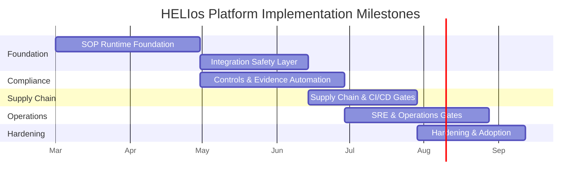
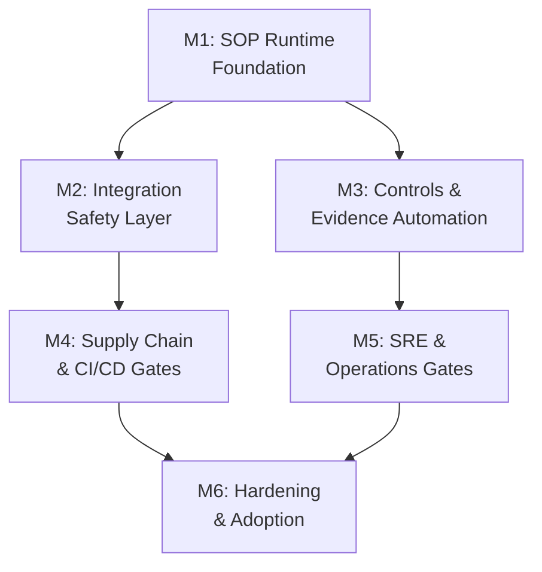
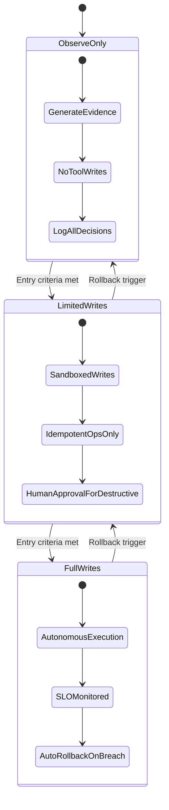

# SDLC Platform Implementation — Roadmap & Milestones

> Captures the prioritized change list, implementation milestone sequencing, and rollout strategy for translating HELIos governance documentation into an executable platform. Diagrams show sequencing logic and dependencies — no effort estimates are included per standing governance rules.

---

## 1. Prioritized Change List

### P0 — Foundation (Must-Have for SOP Execution)

| # | Change | Scope | Dependencies | Governance Rule |
|---|--------|-------|--------------|-----------------|
| 1 | Implement SOP execution engine with versioned SOPs, run tracing, and immutable evidence bundles | Platform + DB + APIs | Schema migrations; access model; artifact storage | No gate closes without evidence bundle and run record |
| 2 | Adopt standard agent message envelope with correlation IDs + idempotency keys; implement retries, dead-letter handling, compensation | Platform + integrations | Tool adapters; structured logging | All external writes must be idempotent and trace-linked |
| 3 | Formalize control library and mappings using OSCAL-compatible structures; automate evidence-to-control linking | Data model + compliance workflows | Control taxonomy; framework mapping inputs | Controls are data, not prose; mappings are queryable |
| 4 | Resolve agent responsibility drift: clarify overlapping charters; align acronyms and permissions | Agent definitions + SOP ownership | Governance decision | One agent, one primary charter; avoid acronym collisions |

### P1 — Integration & Enforcement

| # | Change | Scope | Dependencies | Governance Rule |
|---|--------|-------|--------------|-----------------|
| 5 | Upgrade CI/CD supply chain posture: SBOM (SPDX/CycloneDX), provenance (SLSA), signing enforced as release gates | Pipelines + DSCA/ATADA/RRA SOPs | CI tool selection; registry; signing identity | Cannot deploy unprovenanced artifacts |
| 6 | Operationalize SLOs and error budgets as first-class gate inputs; enforce release freezes when budgets exhausted | ORFA/SOA/QMSA + release gates | Telemetry source; SLO definitions | Reliability governed via error budgets |
| 7 | Implement centralized audit logging and log governance (classification, redaction, retention) | Platform + policies | Log store; retention policy | Logs are evidence; evidence is protected and minimized |

### P2 — Hardening & Adoption

| # | Change | Scope | Dependencies | Governance Rule |
|---|--------|-------|--------------|-----------------|
| 8 | Add SOP regression testing harness (policy-as-code) and CI validation before SOP publish | Governance + CI | Fixtures; SOP test runner | SOP changes are production changes |
| 9 | Expand rollout mechanics: progressive delivery hooks, automated rollback criteria, incident-postmortem linkage | Release + SRE workflows | Deployment platform capabilities | Every release is reversible; rollback is rehearsed |
| 10 | Developer experience automation: template scaffolds, onboarding, and toil metrics | Templates + DXA | Baseline templates; metrics ingestion | DX improvements must reduce measurable toil |

---

## 2. Implementation Milestone Sequence

*Note: Gantt bars show sequencing and dependencies only. Bar lengths represent relative complexity, not calendar commitments. No effort estimates are provided per standing governance rules.*

### Milestone Detail

| # | Milestone | What Ships | Dependencies | Exit Criteria |
|---|-----------|------------|--------------|---------------|
| M1 | SOP Runtime Foundation | DB schema + SOP registry/versioning + run/step traces + artifact references + access control baselines | Data layer + auth model | One gate executes end-to-end and produces a validated evidence bundle |
| M2 | Integration Safety Layer | Standard message envelope; idempotent tool adapters; retry/compensation semantics; dead-letter alerting | Tool adapters across integrated services | External writes are replay-safe and trace-linked |
| M3 | Controls & Evidence Automation | OSCAL-aligned control catalogs; control mappings; evidence exports; exception workflows | Framework selection (SOC 2/HIPAA/CSA) | At least one framework family mapped and exportable |
| M4 | Supply Chain & CI/CD Gates | SBOM generation; provenance attestations; signing; policy gates integrated with release readiness | CI choice + signing strategy | Artifacts blocked from release without SBOM + provenance |
| M5 | SRE & Operations Gates | SLO definitions; burn-rate alerts; error-budget freeze policy; incident and postmortem SOP automation | Telemetry + on-call model | Release readiness consumes SLO signals and applies freeze rules |
| M6 | Hardening & Adoption | SOP regression test harness; dashboards (DORA + SLO); rollout/rollback playbooks; training and governance cadence | Metrics plane + governance ownership | SOP publishing follows change enablement discipline |

### Dependency Graph

---

## 3. Rollout Strategy — 3-Stage Agent Autonomy

Agent autonomy is introduced in a staged manner. Each stage has explicit entry criteria and rollback triggers.

### Stage Definitions

| Stage | What Agents Can Do | Entry Criteria | Rollback Trigger |
|-------|-------------------|----------------|------------------|
| **Observe-Only** | Generate evidence, log decisions, evaluate gates — but NO tool writes. Agents run in read-only mode against all integrations. | M1 complete: SOP runtime operational, evidence bundles producing correctly | — (initial state) |
| **Limited Writes** | Sandboxed writes to non-production environments. Idempotent operations only. Destructive operations require human approval via HAA. | Observe-only stable for defined period. No false-positive evidence bundles. Idempotency contracts verified. | Evidence bundle integrity failures, unexpected write patterns, or HAA escalation rate above threshold |
| **Full Writes** | Autonomous execution in production. SLO-monitored. Automatic rollback on SLO breach. Feature flags for progressive delivery. | Limited writes stable. SLO burn rates nominal. Rollback playbooks validated. | SLO budget exhaustion, incident severity threshold crossed, or postmortem action items unresolved |

---

## 4. External Framework References

The following industry frameworks inform the roadmap. These are reference standards — authoritative source URLs provided for team research.

| Framework | What It Covers | Authoritative Source |
|-----------|---------------|---------------------|
| **NIST SSDF (SP 800-218)** | Secure Software Development Framework — practices and tasks for risk reduction across the SDLC | https://csrc.nist.gov/publications/detail/sp/800-218/final |
| **SLSA (Supply-chain Levels for Software Artifacts)** | Graduated levels of supply chain security with provenance attestation requirements | https://slsa.dev/ |
| **NIST OSCAL (Open Security Controls Assessment Language)** | Machine-readable formats (XML/JSON/YAML) for automated compliance control assessment | https://pages.nist.gov/OSCAL/ |
| **Google SRE — SLOs and Error Budgets** | Site Reliability Engineering model for managing reliability as a negotiated budget | https://sre.google/sre-book/service-level-objectives/ |
| **DORA Four Key Metrics** | Deployment frequency, lead time for changes, change failure rate, time to restore service | https://dora.dev/ |
| **ISO 29148** | Requirements engineering — processes and information items | https://www.iso.org/standard/72089.html |
| **ISO 25010** | Product quality model — characteristics and subcharacteristics for quality gates | https://www.iso.org/standard/35733.html |
| **ITIL 4 Change Enablement** | Change management practice for risk assessment, authorization, and scheduling | https://www.axelos.com/certifications/itil-service-management |
| **OWASP LLM/GenAI Top 10** | Security risks specific to LLM and agentic AI systems | https://owasp.org/www-project-top-10-for-large-language-model-applications/ |

---

## Related Documents

- Platform Readiness Assessment: [`helios/governance/platform-readiness-assessment.md`](../../governance/platform-readiness-assessment.md)
- Enhanced Data Model: [`helios/reference/diagrams/erd-enhanced-data-model.md`](erd-enhanced-data-model.md)
- SOP Template Structure: [`helios/reference/diagrams/sop-template-structure.md`](sop-template-structure.md)
- KPI Framework: [`helios/governance/kpi-framework.md`](../../governance/kpi-framework.md)
