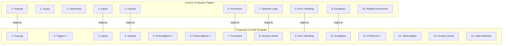

# Autonomous SOP Template Structure & Gap Analysis

> Defines the 14-field autonomous SOP template recommended for executable agent SOPs, compares it to the current 10-section HELIos SOP pattern, identifies gaps, and documents the 7 translation rules for converting human-operated SOPs to autonomous agent SOPs. This is a reference specification — SOP template changes require governance approval.

---

## 1. Current 10-Section SOP Pattern

The current HELIos SOP standard uses this mandatory structure:

| # | Section | Description |
|---|---------|-------------|
| 1 | Purpose | What the SOP accomplishes |
| 2 | Scope | Boundaries and applicability |
| 3 | Ownership | Responsible agent and approvers |
| 4 | Inputs | Required inputs and their sources |
| 5 | Outputs | Produced artifacts and deliverables |
| 6 | Procedure | Step-by-step actions |
| 7 | Decision Logic | Conditional branching and thresholds |
| 8 | Escalation | When and how to escalate |
| 9 | Error Handling | Failure modes and recovery |
| 10 | Related Documents | Cross-references to other governance artifacts |

---

## 2. Proposed 14-Field Autonomous SOP Template

The enhanced template treats each SOP as a **contract** between the orchestrator, the executing agent, integrated tools/cloud services, and governance/audit consumers.

| # | Field | Description | Standard Reference |
|---|-------|-------------|-------------------|
| 1 | **Purpose** | Measurable outcome, not a list of actions. Outcomes-oriented. | NIST SSDF |
| 2 | **Trigger(s)** | Event types that invoke the SOP: manual, webhook, schedule, gate evaluation. | — |
| 3 | **Inputs** | Typed inputs, source-of-truth references, data classification (including PHI flags). | NIST SP 800-92, HIPAA |
| 4 | **Outputs** | Artifacts, state transitions, evidence bundle items, and emitted metrics. | — |
| 5 | **Preconditions** | Phase state, required approvals, required prior artifacts, integration availability. | — |
| 6 | **Postconditions** | What must be true for the SOP to be marked successful. | — |
| 7 | **Procedure** | Each step includes: action, target system, idempotency key, expected evidence, timeout, retry policy. | AWS Well-Architected |
| 8 | **Decision Rules** | Deterministic thresholds, risk scoring, block/hold/go criteria. | ITIL Change Enablement |
| 9 | **Error Handling** | Retry rules, compensating actions, dead-letter escalation, partial-failure resolution. | ISO 12207 |
| 10 | **Escalation** | Who to page/notify and when; tied to on-call or approval authority. | ITIL Incident Mgmt |
| 11 | **KPIs / SLOs / SLAs** | Per-SOP success metrics and time targets; includes DORA metrics and SLO/error-budget linkage. | DORA, Google SRE |
| 12 | **Observability & Logging** | Structured events, trace IDs, redaction rules, retention class. | NIST SP 800-92 |
| 13 | **Access Control** | Required scopes/permissions per integration, least privilege, rotation/expiry model. | Zero Trust / NIST SP 800-207 |
| 14 | **Data Retention** | Artifact retention schedule, deletion policy, sensitive data handling constraints. | HIPAA, SOC 2 |

---

## 3. Gap Analysis: Current vs. Proposed

### Gap Summary

| Gap | Current State | Proposed State | Priority | Recommendation |
|-----|---------------|----------------|----------|----------------|
| **Triggers** | Implicit in Procedure or not stated | Explicit trigger types: manual, webhook, schedule, gate evaluation | High | Close this gap. Triggers are required for SOP execution engine dispatch. |
| **Preconditions** | Partially in Scope section | Explicit: phase state, required prior artifacts, integration availability | High | Close this gap. Preconditions prevent premature SOP execution. |
| **Postconditions** | Not present | Explicit: what must be true for SOP marked successful | High | Close this gap. Postconditions enable deterministic success/failure evaluation. |
| **Per-SOP KPIs/SLOs** | KPIs exist at framework level only | Per-SOP success metrics, time targets, DORA linkage | Medium | Close this gap for P0 SOPs first. Defer for lower-priority SOPs. |
| **Observability & Logging** | Partially in Error Handling | Explicit: structured events, trace IDs, redaction rules, retention class | Medium | Formalize as a section. Many SOPs already describe logging implicitly. |
| **Access Control** | Not present (implied by agent tier) | Explicit: scopes per integration, least privilege, rotation model | Medium | Close this gap when platform integration is implemented. |
| **Data Retention** | Not present (implied by PDA agent) | Explicit: retention schedule, deletion policy, sensitive data constraints | Low | Defer to PDA governance. Add to SOPs that handle PHI or regulated data. |
| **Scope (removed)** | Dedicated section | Merged into Purpose + Preconditions | — | Not a gap. Content redistributed. |
| **Ownership (removed)** | Dedicated section | Covered by HELIos YAML front matter metadata | — | Not a gap. Already captured in file headers. |
| **Related Documents (removed)** | Dedicated section | Standard markdown convention at bottom of any document | — | Not a gap. Already standard practice. |

---

## 4. Translation Rules: Human SOPs → Autonomous Agent SOPs

These 7 rules govern the conversion of traditional human-operated SOPs into bounded decision programs for autonomous agent execution:

### Rule 1: Define Outcomes, Not Activities
SOPs must be structured as practices and tasks with outcomes and repeatability, not ad hoc "best effort" instructions. Each SOP must answer: "What measurable state change does this produce?"

> *Grounded in: NIST SSDF — practices and tasks integrated into SDLC for risk reduction.*

### Rule 2: Every Step Must Produce Evidence
Logging and evidence must be structured rather than incidental. Every SOP step must define its expected evidence artifact, because autonomy increases the volume of actions and reduces human observation.

> *Grounded in: NIST SP 800-92 — robust processes for log generation, collection, and retention.*

### Rule 3: Risk Gates Must Be Deterministic
Agents need explicit decision thresholds, not conversational ambiguity. Every decision point must define block/hold/go criteria with measurable conditions.

> *Grounded in: ITIL Change Enablement — risk assessment, authorization, and scheduling for successful changes.*

### Rule 4: Treat Compliance as Data
Controls and mappings must be queryable, not locked in prose documents. When agents execute at scale, paper-based compliance doesn't work.

> *Grounded in: NIST OSCAL — machine-readable formats for automated control assessment.*

### Rule 5: Treat Supply Chain Security as a Pipeline Property
Artifact trust requires pipeline-level assurance and attestations, not post-hoc verification. Build integrity must be proven, not assumed.

> *Grounded in: NIST SP 800-204D (supply chain in CI/CD), SLSA (provenance framework).*

### Rule 6: Manage Reliability as a Controlled Budget
Insisting on 100% uptime is undesirable. Error budgets provide objective policy for when to freeze releases or shift effort to reliability work.

> *Grounded in: Google SRE — SLOs and error budgets for balancing innovation and stability.*

### Rule 7: Architect Automation with Guardrails
SOP versioning, controlled rollout, and periodic review are not optional. Every automated process must be reversible, auditable, and regularly refined.

> *Grounded in: AWS Well-Architected — safe automation, reversible changes, regular procedure refinement.*

---

## 5. Implementation Recommendation

### Phase 1: Close High-Priority Gaps
Add **Triggers**, **Preconditions**, and **Postconditions** to the SOP template. These 3 fields are required for the SOP execution engine to dispatch, validate, and evaluate SOPs programmatically.

### Phase 2: Formalize Per-SOP Observability
Add **Observability & Logging** and **KPIs/SLOs** to SOPs that are candidates for autonomous execution (starting with P0 priority SOPs from the platform readiness assessment).

### Phase 3: Add Security & Retention Fields
Add **Access Control** and **Data Retention** fields when platform integrations are implemented and real tool credentials are in scope.

### Governance Note
Modifying the SOP template standard affects all 87 existing SOPs. The recommended approach is:
1. Update the template standard document
2. Apply the new fields to new SOPs immediately
3. Backfill existing SOPs incrementally, starting with SOPs that will be automated first (P0)
4. Do NOT bulk-update all 87 SOPs at once — that creates a review bottleneck

---

## Related Documents

- SOP Execution Data Model: [`helios/reference/sop-execution-data-model.md`](../sop-execution-data-model.md)
- Enhanced Data Model: [`helios/reference/diagrams/erd-enhanced-data-model.md`](erd-enhanced-data-model.md)
- Platform Readiness Assessment: [`helios/governance/platform-readiness-assessment.md`](../../governance/platform-readiness-assessment.md)
