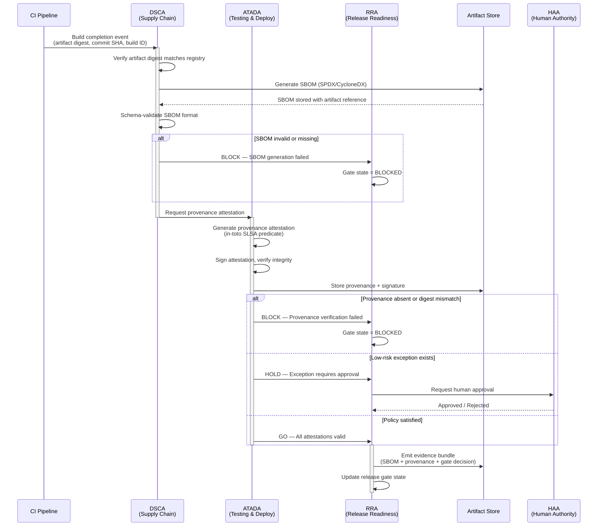
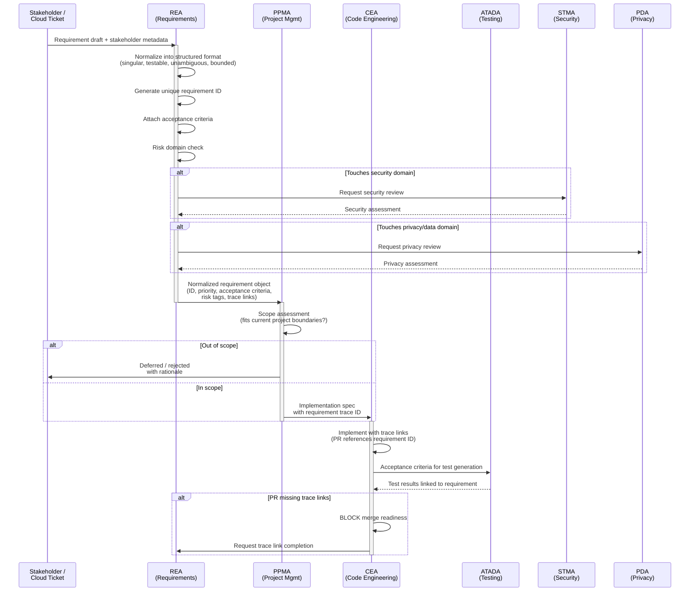
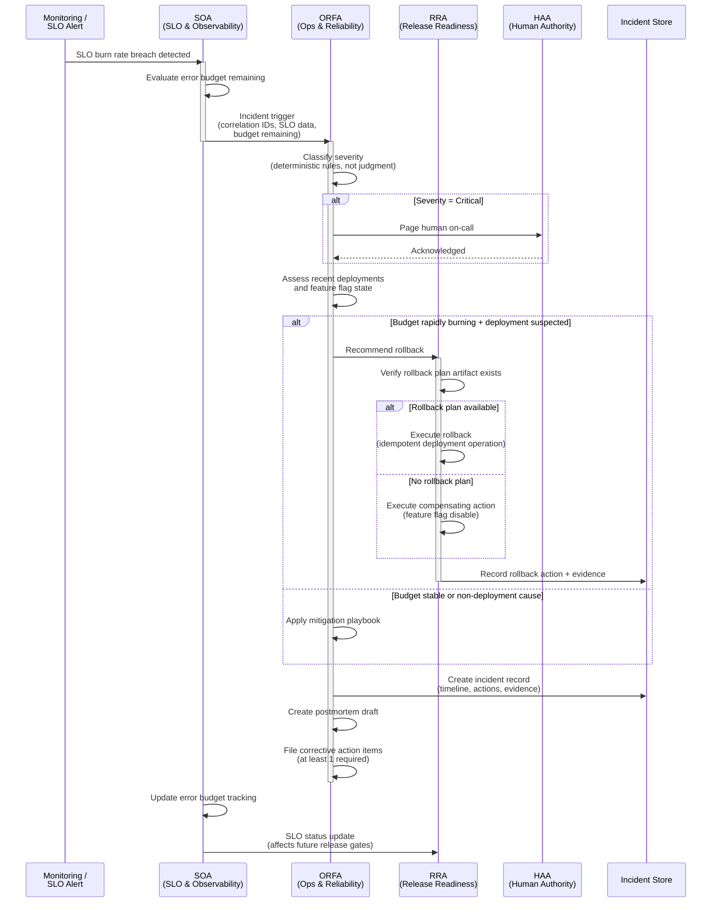

# Multi-Agent SOP Workflow Examples

> Three reference workflow diagrams illustrating how multiple HELIos agents coordinate through SOP execution chains. Each example shows the trigger, participating agents, decision points, evidence artifacts produced, and escalation paths. These are representative patterns — actual execution depends on platform implementation.

---

## 1. Supply Chain Attestation Gate

**Agents:** DSCA (Dependency & Supply Chain) → ATADA (Automated Testing & Deployment) → RRA (Release Readiness)

**Purpose:** Prevent promotion of build artifacts to release unless the artifact has (a) SBOM in an accepted format and (b) provenance attestation aligned to a chosen SLSA target level.

**Triggers:** Build completion event from CI, dependency update merged, or release readiness evaluation.

### Evidence Artifacts Produced
| Artifact | Type | Producing Agent | Classification |
|----------|------|-----------------|----------------|
| SBOM (SPDX or CycloneDX) | Attestation | DSCA | INTERNAL |
| Provenance attestation (SLSA predicate) | Attestation | ATADA | INTERNAL |
| Signature record | Certificate | ATADA | CONFIDENTIAL |
| Gate decision record | Report | RRA | INTERNAL |
| Evidence bundle | Bundle | RRA | INTERNAL |

### KPIs
- Coverage: % of release artifacts with SBOM + provenance
- Mean time to resolve supply chain violations (by severity)
- Pipeline failure rate attributable to supply chain gates

---

## 2. Requirement Change Control & Traceability

**Agents:** REA (Requirements Engineering) → PPMA (Project Management) → CEA (Code Engineering)

**Purpose:** Maintain requirement integrity and traceability so every production change is linked to normalized requirements and acceptance criteria, preserving lifecycle traceability per ISO 29148.

**Triggers:** New requirement submitted, existing requirement modified, or PR opened without linked requirement.

### Evidence Artifacts Produced
| Artifact | Type | Producing Agent | Classification |
|----------|------|-----------------|----------------|
| Normalized requirement object | Report | REA | INTERNAL |
| Traceability matrix update | Report | REA | INTERNAL |
| Change control record | Report | REA | INTERNAL |
| Scope assessment | Report | PPMA | INTERNAL |
| Implementation spec with trace IDs | Report | CEA | INTERNAL |
| Acceptance test results | Attestation | ATADA | INTERNAL |

### KPIs
- Trace completeness: % of PRs with requirement IDs and acceptance criteria coverage
- Requirement churn rate post-design freeze

---

## 3. Incident-Driven Rollback & Postmortem

**Agents:** ORFA (Ops & Reliability) → RRA (Release Readiness) → SOA (SLO & Observability)

**Purpose:** Restore normal operation quickly and consistently, and generate post-incident learning artifacts. Aligns incident handling with ITIL incident management and SRE error-budget practices.

**Triggers:** SLO burn rate breach, deployment-related error spike, or customer-impact incident declared.

### Evidence Artifacts Produced
| Artifact | Type | Producing Agent | Classification |
|----------|------|-----------------|----------------|
| Incident record with timeline | Report | ORFA | INTERNAL |
| Rollback execution record | Log | RRA | INTERNAL |
| Rollback evidence | Attestation | RRA | INTERNAL |
| Postmortem draft | Report | ORFA | INTERNAL |
| Corrective action items | Report | ORFA | INTERNAL |
| Error budget update | Report | SOA | INTERNAL |

### KPIs
- Failed deployment recovery time (DORA dimension)
- Time to restore service
- % incidents with completed postmortems and closed corrective actions

---

## Interaction Pattern Summary

| Pattern | Flow | Coordination Mechanism |
|---------|------|----------------------|
| Supply Chain → Release | DSCA → ATADA → RRA | Evidence chain: SBOM + provenance required for gate GO |
| Requirements → Implementation → Testing | REA → PPMA → CEA → ATADA | Trace IDs: every PR must reference a requirement |
| Incident → Rollback → Learning | ORFA → RRA → SOA | SLO signals drive rollback decisions; postmortems produce backlog items |

---

## Related Documents

- Agent Communication Protocol: [`helios/reference/agent-communication-protocol.md`](../agent-communication-protocol.md)
- Enhanced Data Model: [`helios/reference/diagrams/erd-enhanced-data-model.md`](erd-enhanced-data-model.md)
- Escalation Protocols: [`helios/reference/escalation-protocols.md`](../escalation-protocols.md)
