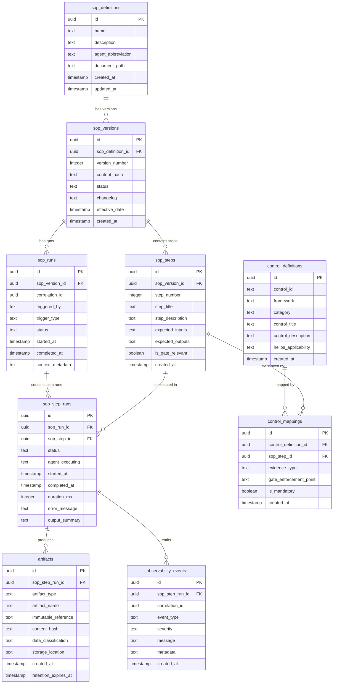

# SOP Execution Data Model

> Platform engineering architecture reference for the SOP execution engine. Defines the entity model for SOP versioning, execution tracing, artifact retention, observability events, and compliance control mappings. This is a reference specification — implementation is the responsibility of the platform engineering team.

---

## Purpose

The HELIos pipeline defines SOPs as governed markdown documents. When these SOPs are executed by agents, the execution must be tracked with the same rigor as the SOP definitions themselves. This data model provides the entity architecture for:

1. **SOP definition versioning** — Tracking which version of which SOP was executed
2. **Execution tracing** — Recording every run and every step within a run
3. **Artifact retention** — Linking produced artifacts to the steps that created them
4. **Observability events** — Capturing timing, status, and health data per step
5. **Control mapping** — Connecting SOP steps and artifacts to compliance controls

---

## Scope

This document is an architecture reference. It defines:
- Entity relationships and schemas for the SOP execution engine
- Design objectives and constraints
- Supabase implementation notes

This document does NOT:
- Specify API endpoints (that is platform engineering implementation)
- Define migration scripts (that is deployment engineering)
- Prescribe UI/UX for execution dashboards (that is product design)

---

## 1. Entity Relationship Diagram



---

## 2. Entity Descriptions

### sop_definitions
The canonical registry of all SOPs in the HELIos pipeline. Each row represents a unique SOP.

| Column | Type | Description |
|--------|------|-------------|
| `id` | UUID (PK) | Unique identifier |
| `name` | TEXT | SOP name |
| `description` | TEXT | Brief description of the SOP's purpose |
| `agent_abbreviation` | TEXT | Owning agent (e.g., `PPMA`, `CEA`, `ABE`) |
| `document_path` | TEXT | File path in the repository |
| `created_at` | TIMESTAMPTZ | When the SOP was first registered |
| `updated_at` | TIMESTAMPTZ | Last modification timestamp |

### sop_versions
Version history for each SOP definition. SOPs are immutable once published — changes create new versions.

| Column | Type | Description |
|--------|------|-------------|
| `id` | UUID (PK) | Unique identifier |
| `sop_definition_id` | UUID (FK) | Reference to parent SOP definition |
| `version_number` | INTEGER | Monotonically increasing version number |
| `content_hash` | TEXT | SHA-256 hash of the SOP document content at this version |
| `status` | TEXT | `draft`, `active`, `archived` |
| `changelog` | TEXT | Description of what changed in this version |
| `effective_date` | TIMESTAMPTZ | When this version became active |
| `created_at` | TIMESTAMPTZ | When this version record was created |

### sop_steps
The individual steps within a versioned SOP. Each step maps to a procedural step in the SOP document.

| Column | Type | Description |
|--------|------|-------------|
| `id` | UUID (PK) | Unique identifier |
| `sop_version_id` | UUID (FK) | Reference to parent SOP version |
| `step_number` | INTEGER | Ordinal position within the SOP |
| `step_title` | TEXT | Human-readable step name (e.g., "Validate Mandatory Field Completeness") |
| `step_description` | TEXT | Description of what the step does |
| `expected_inputs` | TEXT (JSON) | Structured description of required inputs |
| `expected_outputs` | TEXT (JSON) | Structured description of expected outputs |
| `is_gate_relevant` | BOOLEAN | Whether this step produces evidence for a lifecycle gate |
| `created_at` | TIMESTAMPTZ | When this step was registered |

### sop_runs
A single execution instance of a versioned SOP. Tracks the entire run from start to completion.

| Column | Type | Description |
|--------|------|-------------|
| `id` | UUID (PK) | Unique identifier |
| `sop_version_id` | UUID (FK) | Which version of the SOP was executed |
| `correlation_id` | UUID | Links to the workflow's correlation_id (from Agent Communication Protocol) |
| `triggered_by` | TEXT | Agent or event that triggered the run |
| `trigger_type` | TEXT | `automated`, `on_demand`, `emergency`, `scheduled` |
| `status` | TEXT | `running`, `completed`, `failed`, `compensated` |
| `started_at` | TIMESTAMPTZ | When execution began |
| `completed_at` | TIMESTAMPTZ | When execution ended (null if still running) |
| `context_metadata` | TEXT (JSON) | Additional context (ticket ID, project ID, etc.) |

### sop_step_runs
An individual step execution within a SOP run. One row per step per run.

| Column | Type | Description |
|--------|------|-------------|
| `id` | UUID (PK) | Unique identifier |
| `sop_run_id` | UUID (FK) | Reference to parent SOP run |
| `sop_step_id` | UUID (FK) | Reference to the step definition being executed |
| `status` | TEXT | `pending`, `running`, `completed`, `failed`, `skipped` |
| `agent_executing` | TEXT | Agent abbreviation that executed this step |
| `started_at` | TIMESTAMPTZ | When step execution began |
| `completed_at` | TIMESTAMPTZ | When step execution ended |
| `duration_ms` | INTEGER | Execution duration in milliseconds |
| `error_message` | TEXT | Error details if status is `failed` |
| `output_summary` | TEXT (JSON) | Summary of step outputs |

### artifacts
Evidence and output artifacts produced by SOP step executions. Artifacts are immutable once created.

| Column | Type | Description |
|--------|------|-------------|
| `id` | UUID (PK) | Unique identifier |
| `sop_step_run_id` | UUID (FK) | Reference to the step run that produced this artifact |
| `artifact_type` | TEXT | `log`, `report`, `attestation`, `configuration`, `certificate`, `screenshot` |
| `artifact_name` | TEXT | Human-readable name |
| `immutable_reference` | TEXT | Hash or immutable URL — artifact content cannot change after creation |
| `content_hash` | TEXT | SHA-256 hash of artifact content |
| `data_classification` | TEXT | `PUBLIC`, `INTERNAL`, `CONFIDENTIAL`, `RESTRICTED` |
| `storage_location` | TEXT | Where the artifact is stored (Supabase Storage bucket, Git commit, etc.) |
| `created_at` | TIMESTAMPTZ | When the artifact was created |
| `retention_expires_at` | TIMESTAMPTZ | When the artifact may be deleted per retention policy |

### observability_events
Runtime observability events emitted during SOP step execution. Used for monitoring, alerting, and post-hoc analysis.

| Column | Type | Description |
|--------|------|-------------|
| `id` | UUID (PK) | Unique identifier |
| `sop_step_run_id` | UUID (FK) | Reference to the step run that emitted this event |
| `correlation_id` | UUID | Workflow correlation ID for cross-step tracing |
| `event_type` | TEXT | `info`, `warning`, `error`, `metric`, `state_transition` |
| `severity` | TEXT | `low`, `medium`, `high`, `critical` |
| `message` | TEXT | Human-readable event description |
| `metadata` | TEXT (JSON) | Structured event data |
| `created_at` | TIMESTAMPTZ | When the event was emitted |

### control_definitions
Registry of compliance controls from external frameworks. Sourced from the Compliance Control Mapping Framework.

| Column | Type | Description |
|--------|------|-------------|
| `id` | UUID (PK) | Unique identifier |
| `control_id` | TEXT | External control identifier (e.g., `SOC2-CC7-003`) |
| `framework` | TEXT | Source framework (`SOC2`, `HIPAA`, `NIST_CSF`, `CSA_CAIQ`) |
| `category` | TEXT | Framework-specific category |
| `control_title` | TEXT | Human-readable control name |
| `control_description` | TEXT | Full control requirement text |
| `helios_applicability` | TEXT | How HELIos produces evidence for this control |
| `created_at` | TIMESTAMPTZ | When the control was registered |

### control_mappings
Links compliance controls to specific SOP steps, defining what evidence is required and where it is enforced.

| Column | Type | Description |
|--------|------|-------------|
| `id` | UUID (PK) | Unique identifier |
| `control_definition_id` | UUID (FK) | Reference to the control |
| `sop_step_id` | UUID (FK) | Reference to the SOP step that produces evidence |
| `evidence_type` | TEXT | What kind of evidence this mapping expects |
| `gate_enforcement_point` | TEXT | Which lifecycle gate enforces this mapping |
| `is_mandatory` | BOOLEAN | Whether this evidence is required or optional for the control |
| `created_at` | TIMESTAMPTZ | When the mapping was created |

---

## 3. Design Objectives

| Objective | Implementation Approach |
|-----------|------------------------|
| **Multi-tenancy** | RLS policies scope all queries to the executing agent's context. Cross-agent queries require explicit authorization. |
| **Version control** | SOPs are versioned immutably. Runs always reference a specific version. Content hashes verify integrity. |
| **Execution traces** | Every run and step run is recorded with timestamps, durations, and statuses. Correlation IDs enable end-to-end tracing. |
| **Evidence retention** | Artifacts are immutable (content_hash verified). Retention policies are enforced via `retention_expires_at`. |
| **Control mappings** | Controls are linked to SOP steps (not runs) so the mapping persists across executions. Evidence completeness is checked at gates. |
| **Observability** | Events are emitted during execution and queryable by correlation_id, event_type, and severity. |

---

## 4. Supabase Implementation Notes

### Row-Level Security (RLS) Patterns

| Table | RLS Policy |
|-------|-----------|
| `sop_definitions` | Read: all authenticated. Write: `process_owner` role only. |
| `sop_versions` | Read: all authenticated. Write: `process_owner` role only. Insert triggers content_hash verification. |
| `sop_runs` | Read: executing agent + governance agents (PGA, HAA). Write: executing agent only. |
| `sop_step_runs` | Same as `sop_runs`. |
| `artifacts` | Read: producing agent + governance agents + ARA. Write: producing agent only. No updates or deletes (immutable). |
| `observability_events` | Read: ORFA + producing agent + governance agents. Write: producing agent only. |
| `control_definitions` | Read: all authenticated. Write: ARA + PGA only. |
| `control_mappings` | Read: all authenticated. Write: ARA + PGA only. |

### Audit Log Integration

All write operations on these tables should trigger audit log entries in Supabase's built-in audit infrastructure. The audit log captures:
- Who (agent identity)
- What (table, operation, old/new values)
- When (timestamp)
- Why (correlation_id for workflow context)

### Immutable Artifact References

Artifacts must not be modifiable after creation. Implementation options:
1. **Supabase Storage with signed URLs** — Artifact uploaded to a write-once bucket. Signed URL serves as immutable reference.
2. **Git commit references** — For code-based artifacts, the Git commit SHA serves as the immutable reference.
3. **Content-addressable storage** — SHA-256 hash of content used as storage key. Any content modification produces a different key.

---

## 5. Query Patterns

### Trace a workflow end-to-end

```sql
SELECT sr.*, ssr.*, a.*
FROM sop_runs sr
JOIN sop_step_runs ssr ON ssr.sop_run_id = sr.id
LEFT JOIN artifacts a ON a.sop_step_run_id = ssr.id
WHERE sr.correlation_id = '{correlation_id}'
ORDER BY ssr.started_at;
```

### Check evidence completeness for a gate

```sql
SELECT cd.control_id, cd.control_title, cm.evidence_type, cm.is_mandatory,
       CASE WHEN a.id IS NOT NULL THEN 'present' ELSE 'missing' END as evidence_status
FROM control_mappings cm
JOIN control_definitions cd ON cd.id = cm.control_definition_id
LEFT JOIN sop_step_runs ssr ON ssr.sop_step_id = cm.sop_step_id
  AND ssr.sop_run_id IN (SELECT id FROM sop_runs WHERE correlation_id = '{correlation_id}')
LEFT JOIN artifacts a ON a.sop_step_run_id = ssr.id
WHERE cm.gate_enforcement_point = '{gate_name}'
  AND cm.is_mandatory = true;
```

### Find SOP execution failures in the last 24 hours

```sql
SELECT sd.name, sv.version_number, sr.status, sr.started_at,
       ssr.step_number, ssr.error_message
FROM sop_runs sr
JOIN sop_versions sv ON sv.id = sr.sop_version_id
JOIN sop_definitions sd ON sd.id = sv.sop_definition_id
JOIN sop_step_runs ssr ON ssr.sop_run_id = sr.id
WHERE sr.status = 'failed'
  AND sr.started_at > NOW() - INTERVAL '24 hours'
ORDER BY sr.started_at DESC;
```

---

## Related Documents

- Agent Communication Protocol: `agent-communication-protocol.md`
- Compliance Control Mapping: `compliance-control-mapping.md`
- Integration Matrix: `integration-matrix.md`
- Governance Framework: `../governance/helios-governance-framework-v1.md`
- Constitution: `../agents/00-constitution.md`
